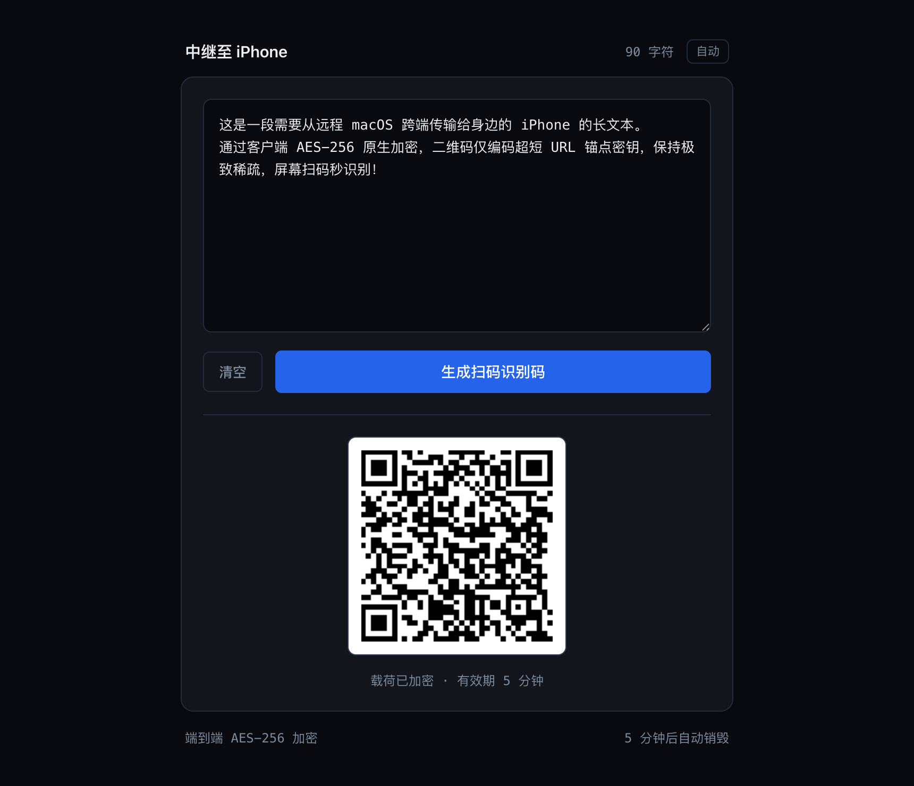
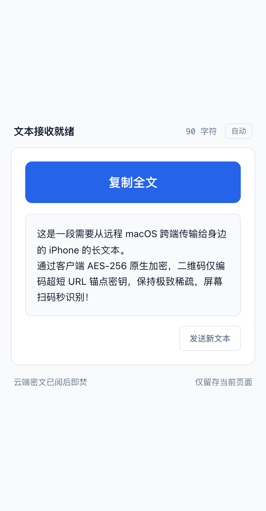

# Text Relay · 极速跨端私密长文本传输

> 解决远程控制（如 RustDesk / TeamViewer / 向日葵）下，无法便捷向手机传输大段长文本的痛点。
> 纯客户端端到端 AES-256 加密 · 云端 5 分钟阅后即焚 · 二维码永远超稀疏极速识别。

---

## 界面预览

| 发送端（桌面 / 夜间模式） | 接收端（iPhone 扫码 / 日间模式） |
| :---: | :---: |
|  |  |

---

## 解决的痛点

1. **远程控制剪贴板同步受限**：通过远程桌面控制家中/公司电脑时，大段长文本（数千到数万字）经常遭遇剪贴板截断或丢格式。
2. **长文本二维码浓稠无法扫描**：传统方案将长文本直接塞入二维码，点阵密如黑墨，手机隔着远程推流屏幕（有摩尔纹和画质损耗）完全无法对焦识别。
3. **第三方平台留痕隐患**：公共剪贴板或即时通讯工具存在数据审计、内容收集或账号关联泄露风险。

## 核心设计

- **二维码永远极度稀疏**：二维码中仅承载包含随机密钥的约 50 字节短链接（如 `https://domain/#i=abc&k=key`）。无论发送多长的文本，二维码始终为低密度大格点，手机斜角、远距离、弱画质下 0.1 秒秒扫。
- **真正的端到端零知识加密（Zero-Knowledge）**：
  - 文本在本地浏览器通过原生 Web Crypto API（AES-256-GCM）加密。
  - 解密密钥保存在 URL 的 Hash 锚点（`#`）中。根据 HTTP 规范，Hash 绝不会发送给服务器。
  - Cloudflare Worker / KV 全程仅能看到乱码密文，无法偷窥明文。
- **云端阅后即焚**：手机端扫码拉取密文后，Worker 立即将 KV 数据物理删除；同时设置 5 分钟硬过期时间（TTL 300s）。
- **手机端单手优化**：扫码后直接进入高对比度视图，顶部提供大面积触控「复制全文」按钮，并附带物理触觉震动反馈。
- **自适应系统外观**：原生支持日间（Light）/ 夜间（Dark）自适应跟随与手动循环切换。

---

## 一键本地体验与部署

本项目为纯原生标准工程，仅依赖 Cloudflare Workers + KV。

### 1. 克隆与安装依赖

```bash
git clone https://github.com/hayoial/text-qr-transfer.git
cd text-qr-transfer
npm install
```

### 2. 创建 Cloudflare KV 命名空间

```bash
npx wrangler kv namespace create TEXT_KV
```

创建成功后，将终端输出的 `id` 写入复制出的 `wrangler.toml` 文件中：

```bash
cp wrangler.example.toml wrangler.toml
# 将 TEXT_KV 的 id 填入 wrangler.toml
```

### 3. 本地调试与上线

```bash
# 本地模拟运行
npm run dev

# 发布到你的 Cloudflare Workers
npm run deploy
```

发布完成后即可得到你的专属域名 `https://text-qr-transfer.<your-subdomain>.workers.dev`。

---

## 协议

[MIT License](LICENSE)
